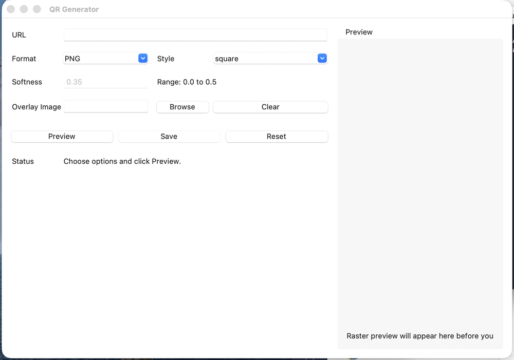
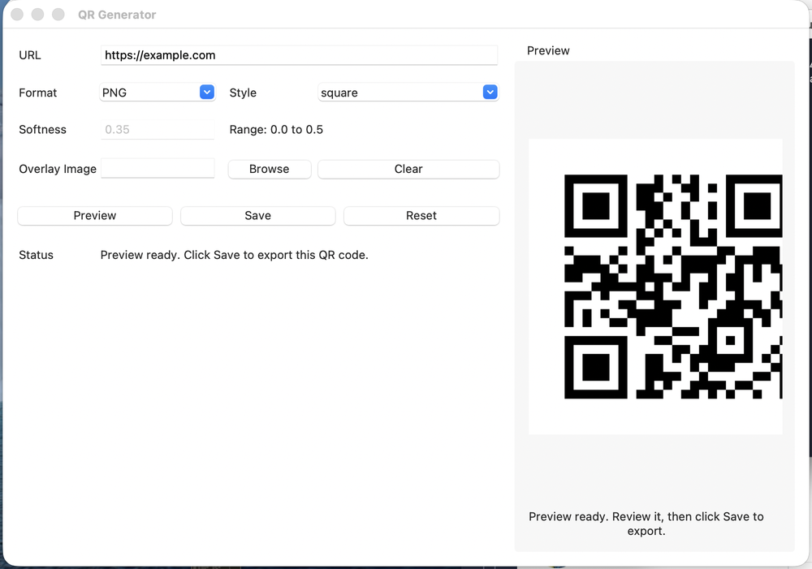
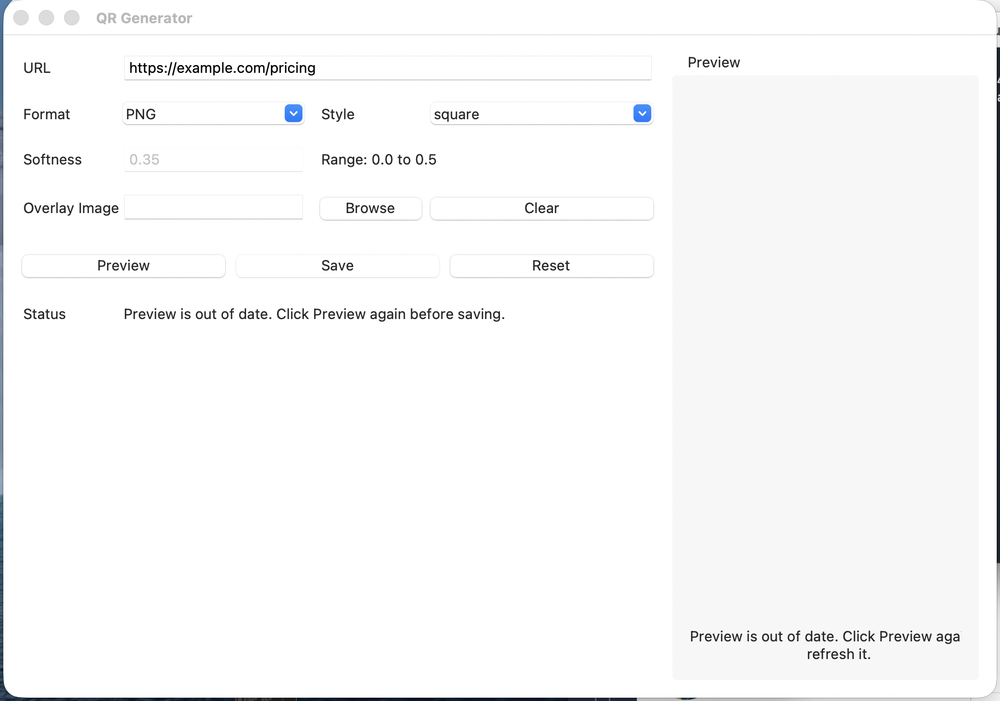
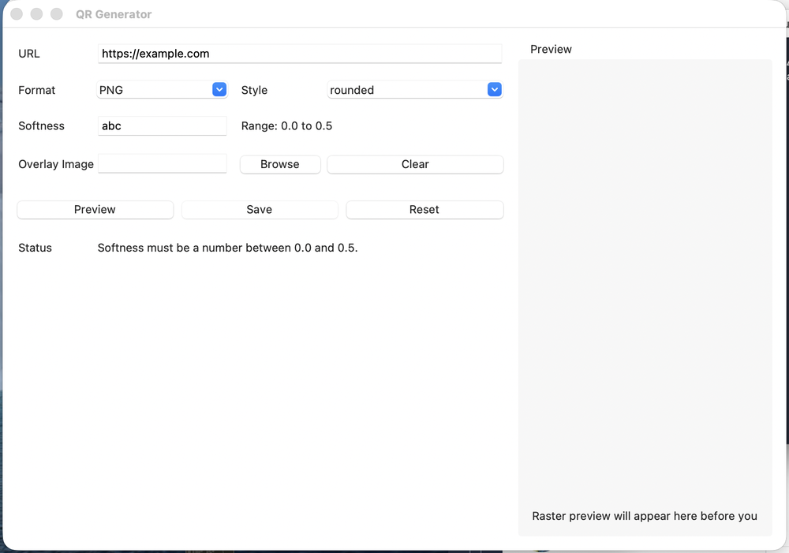
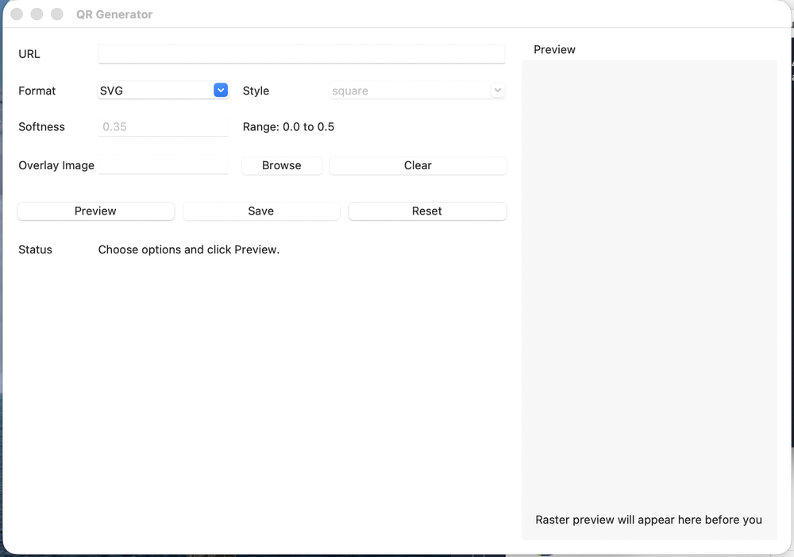
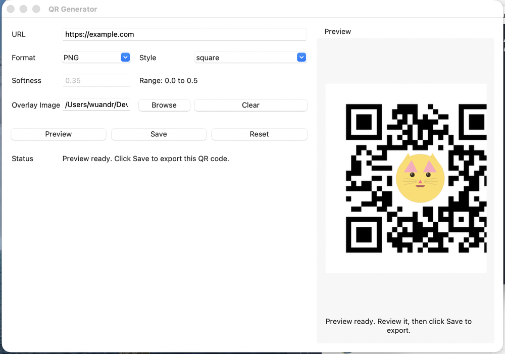
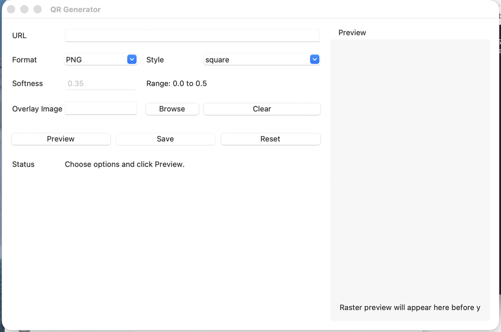

# QR Generator — UI/UX Redesign Proposal

**Status:** Implemented — see [§10](#10-what-shipped) for what was built, changed, and deferred.
**Date:** 2026-07-31 (proposal), 2026-07-31 (implementation)
**Scope:** The desktop app (`qr_gui.py`). The CLI (`generate_qr.py`) and rendering engine (`qr_core.py`) are out of scope except where the GUI needs a new engine capability.
**Goal:** Make the app usable by someone who does not know what "raster", "softness", or "SVG" means — and prepare the UI for a Traditional Chinese (Taiwan) translation.

---

## 1. How this review was done

The app was launched and driven through its flows, with screenshots taken at each state:

- cold start; SVG mode; rounded and `diag_rounded` styles with softness enabled
- empty-URL error; invalid-softness error
- preview render; stale preview after an edit; logo overlay render; SVG "no preview" state
- the app at its own declared minimum window size (860 × 540)

The save flow was exercised but the native macOS save panel could not be captured from this environment, so §4's M4 is based on reading `start_save` rather than on a screenshot. The rendering engine was also driven directly to confirm what the GUI does *not* tell the user: output pixel sizes, render timings, format-vs-extension conflicts, and raw error wording.

**Environment note (worth acting on separately):** this machine's default `python3` (Apple's 3.9 with Tk 8.5) **hangs on window creation** on current macOS — the app never draws. It only runs on a Python with Tk 8.6. For this review I installed `python-tk@3.11` via Homebrew and built a `.venv` from `python3.11`. Anyone cloning this repo on a recent Mac will hit the same wall, so the README setup steps need a Tk version note (see §9).

All screenshots referenced below are in [docs/screenshots/](screenshots/).

---

## 2. Who we are designing for

> Someone who has been asked to "make a QR code for the flyer." They know the web address. They do not know what file format they need, they have never heard of a quiet zone, and they will judge success by whether their phone camera opens the right page.

Three things follow from that persona:

1. **Nothing should require prior knowledge to get a correct result.** Defaults must be right, and jargon must be explained or removed.
2. **The output must be usable where they will use it** — printed on a flyer, pasted into a slide deck. Today's default output is 330 × 330 px, which is too small for print and the app never mentions it.
3. **Failure must be legible.** Right now every message — success, warning, and hard error — appears as the same small grey sentence in the same place.

---

## 3. What the app does today

```
     ┌─────────┐   type URL, pick options
     │  Form   │ ─────────────────────────┐
     └─────────┘                          ▼
                                    ┌──────────┐
     click Preview ────────────────►│ Rendering│
                                    └────┬─────┘
                                         ▼
                              ┌────────────────────┐
                              │ Preview shown,     │
                              │ Save now enabled   │
                              └────┬───────────────┘
        edit ANY field ────────────┤
              │                    ▼
              │            click Save → native save dialog → file written
              ▼
        preview discarded, Save disabled again  ← the trap
```

The core interaction is a **two-step commit**: you must click *Preview* before *Save* becomes available, and touching any field silently throws the preview away.


*Cold start. Nine controls, no guidance about which ones matter, and roughly 40% of the window is empty.*


*The happy path, four interactions in. The rendering engine's output is good — the problems in this review are all in the layer around it.*

---

## 4. Findings

Severity: **High** = blocks or misleads a non-technical user · **Medium** = causes hesitation or rework · **Low** = polish.

### H1. The Preview → Save gate is invisible and it resets constantly

`Save` starts disabled and only unlocks after a successful preview, but macOS ttk renders disabled buttons almost identically to enabled ones — in [the default screenshot](screenshots/01-default-state.png), `Preview`, `Save`, and `Reset` are indistinguishable. A user will click `Save` first, get "Click Preview before saving.", and have to work out the sequence themselves.

It then gets worse: editing *any* field — including fixing a typo in the URL — invalidates the preview, clears the image, and re-disables `Save`.


*One character added to the URL: the preview image is gone and the user is told to start over.*

**Impact:** the most common edit loop (tweak URL → look → save) costs an extra click and a disappearing image every time.

### H2. Core labels are engineering vocabulary

| Shown in the UI | What the user has to already know |
|---|---|
| `Softness` · `Range: 0.0 to 0.5` | that this is corner rounding, and that 0.35 is a sensible number |
| `Style: diag_rounded` | a snake_case internal identifier, [rendered raw in the dropdown](screenshots/03-style-and-softness.png) |
| `Overlay Image` | that this means "your logo, in the middle" |
| `Format: PNG / JPEG / SVG` | which of these their printer or slide deck wants |
| `Raster preview will appear here…` | what "raster" means |

`diag_rounded` in particular is a variable name that escaped into the product.

### H3. The format dropdown can be silently overridden by the filename

The `Format` dropdown does **not** decide the output format. The engine infers format from the extension of whatever the user types in the save dialog (`qr_core.py:72`). Verified:

- Choose **SVG**, name the file `logo.png` → **a PNG is written**. No warning.
- Choose **PNG** with a logo attached, name the file `logo.svg` → an SVG is written, **the logo is silently dropped**, and the "overlay images are not supported for SVG" warning only appears *after* the file is already on disk.

The preview makes this worse rather than catching it: the preview is rendered against the *dropdown's* format, so the user can be looking at a styled PNG with their logo in it and receive a plain black-and-white SVG. The format control is advisory, and the two paths can disagree without the user ever being told.

### H4. Output size is fixed, small, and never disclosed

Every raster export uses `box_size = 10`, giving **330 × 330 px** for a short URL (verified). That is fine on screen and too small for a printed flyer — and nothing in the UI states the pixel size or offers a larger one. A non-technical user has no way to discover the limitation until the print looks fuzzy.

### H5. Errors and successes look identical

Every message — "Enter a URL before generating a QR code.", "Softness must be a number…", "Saved QR code to: /Users/…" — renders as the same small grey text next to a `Status` label, with no colour, no icon, and no highlight on the offending field.


*A validation failure. The invalid `abc` in the field is not marked; the message sits well below it in the same grey as everything else.*

### M1. Disabled controls give no reason

Selecting SVG greys out `Style` and the logo controls, and `Softness` is greyed out whenever the style is `square` — with no explanation in either case.


*Style is greyed out. Softness is greyed out. The logo row still looks live but is not. Nothing says why.*

Worse, `Softness` shows a greyed `0.35` at startup, which reads as "a setting you cannot change" rather than "a setting that does not apply to the square style."

### M2. The logo picker shows a truncated file path

After picking an image the field shows `/Users/wuandr/Dev…` — a clipped absolute path, in a box too narrow to ever show a full one. There is no thumbnail, no filename-only display, and no drag-and-drop.


*The overlay itself works well — the engine auto-sizes the logo and verifies the code still scans. The picker in front of it does not communicate any of that.*

### M3. The right panel is clipped at the app's own minimum size

`minsize` is 860 × 540, but the preview caption uses a fixed `wraplength=300` inside a panel that is narrower than that at small sizes. At the minimum size the caption reads "Raster preview will appear here before y".



### M4. The save dialog starts empty

`asksaveasfilename` is called with no `initialfile` and no `initialdir`, so the user is dropped into a save panel with a blank name field and must invent a filename. An obvious default (`qr-example-com.png`) removes that decision.

### M5. Nothing happens after saving

The file path appears in the status text and that is the end of it. No "Show in Finder", no "Copy image", no way to act on the thing that was just made.

### M6. No keyboard support and no menu bar

`Return` does not trigger preview/generate, there is no `Cmd/Ctrl+S`, and the app ships without a menu bar. The only affordances are the buttons.

### M7. The preview blanks out while you type

Editing any field clears the preview image immediately (`_invalidate_preview_if_needed`), so the panel goes empty and stays empty until the next manual `Preview`. The user loses their reference point exactly when they are comparing options.

Rendering itself is not the problem — measured on this machine, a plain code renders in **~4 ms** and a logo code, including the decode-verification search and the OpenCV import, in **~150–190 ms** even for a 500-character URL. The app is fast; it just hides the result.

### M8. A bare domain is encoded as plain text

Typing `example.com` (no scheme) is accepted silently and encoded literally. Many scanners will then treat it as text rather than a link. The field is labelled `URL` but does not help the user produce one.

### L1. Assorted polish

- The packaged app has no icon (`icon=None` in `qr_gui.spec`) — it ships with a generic placeholder.
- No dark-mode awareness.
- The preview area is an empty grey rectangle at rest with no illustration or call to action.
- `Reset` sits in the primary button row with equal visual weight to `Save`.
- No recently-used URLs, no colour options.

---

## 5. Proposed redesign

### 5.1 Principles

1. **One screen, no modes.** Type, look, save. No preview/save gate, no invalidation.
2. **Say what it does, not what it is.** "Rounded corners", not "softness 0.0–0.5".
3. **Progressive disclosure.** Show advanced controls only when they apply, with a reason when they do not.
4. **The preview is the product.** Give it the space and make it always current.
5. **Every string is translatable.** No sentence assembled from fragments, no text baked into layout width.

### 5.2 Proposed layout

```
┌────────────────────────────────────────────────────────────────────────┐
│  QR Code Maker                                     [ English ▾ ]  ( ? ) │
├──────────────────────────────────────┬─────────────────────────────────┤
│                                      │                                 │
│  Where should this code go?          │        ███▀▄ ▀█ ███             │
│  ┌────────────────────────────────┐  │        █ █ ▄▀▄▀ █ █             │
│  │ https://example.com            │  │        ███ █▄▀▄ ███             │
│  └────────────────────────────────┘  │         ▀▄▀█ ▄▄▀▀▄              │
│  Opens example.com when scanned      │        ███ ▄▀█▄ ▀ ▄             │
│                                      │                                 │
│  Look                                │        (updates as you type)    │
│  ┌────┐ ┌────┐ ┌────┐ ┌────┐ ┌────┐  │                                 │
│  │ ▪▪ │ │ ●● │ │ ▪▪ │ │ ▪▪ │ │ ▪▪ │  │   ✓ Scans correctly             │
│  └────┘ └────┘ └────┘ └────┘ └────┘  │   PNG · 660 × 660 px            │
│  Square  Dots  Rounded Smooth Diagonal│                                 │
│                                      │                                 │
│  Corner rounding   ▁▁▁●▁▁▁▁▁          │                                 │
│                                      │                                 │
│  Logo in the middle (optional)        │                                 │
│  ┌──────────────────────────────────┐ │                                 │
│  │ [🐱]  cat_face.ppm            ✕ │ │                                 │
│  └──────────────────────────────────┘ │                                 │
│  Drop an image here or [ Choose… ]    │                                 │
│                                      │                                 │
│  Size    ( ) Small  (•) Medium  ( ) Large — best for printing          │
│  File    (•) PNG    ( ) JPEG    ( ) SVG                                │
│                                      │                                 │
├──────────────────────────────────────┴─────────────────────────────────┤
│  ✓ Saved to Desktop/qr-example-com.png    [Show in Finder] [Copy]      │
│                                        [ Start over ]  [ Save image ]  │
└────────────────────────────────────────────────────────────────────────┘
```

Key structural changes: the preview owns the right half permanently, the message area becomes a full-width banner at the bottom, and `Save image` is the only primary button.

### 5.3 Interaction changes

| # | Change | Fixes |
|---|---|---|
| A | **Live preview.** Re-render automatically ~300 ms after the last edit, on a worker thread. Remove the `Preview` button and the entire stale-preview concept. | H1 |
| B | **Save is always available** once there is a URL. If a render is in flight, `Save` waits for it rather than refusing. | H1 |
| C | **Never blank the preview.** Keep the last good render on screen, dimmed, while the next one is computed. At 4–190 ms per render a spinner is unnecessary; a single debounce (~300 ms) covers every case including logos. | M7, H1 |
| D | **Format is authoritative.** After the save dialog returns, force the extension to match the selected format instead of inferring format from the name. If the user typed a conflicting extension, correct it and say so in the banner. | H3 |
| E | **Size control** — Small / Medium / Large mapped to `box_size` 10 / 20 / 40 (330 / 660 / 1320 px for a short URL). Show the exact pixel size under the preview, live. Default **Medium**. | H4 |
| F | **Progressive disclosure.** The rounding slider appears only for styles that use it. When a control is unavailable, show one short reason line instead of a silent grey box ("SVG files are always square"). | M1 |
| G | **Logo chip.** Show a 32 px thumbnail + filename + an ✕ to remove, replacing the path field. Accept drag-and-drop onto the window. | M2 |
| H | **Save dialog defaults** — `initialfile` derived from the URL host (`qr-example-com.png`), `initialdir` remembered between saves. | M4 |
| I | **Post-save actions** — "Show in Finder" / "Copy image" appear in the banner after a successful save. | M5 |
| J | **Keyboard + menu bar** — `Return` = save, `Cmd/Ctrl+S` = save, `Cmd/Ctrl+R` = start over, `Esc` = clear focus. Add a real menu bar (File / Edit / Language / Help). | M6 |
| K | **URL help, not URL policing** — if the text has no scheme and looks like a domain, show "We'll use https://example.com" under the field and encode it that way. Never block; any text still encodes. | M8 |
| L | **Scan check badge** — the engine can already decode-verify a render. Show "✓ Scans correctly" under the preview, and a warning when verification fails, so the user gets the reassurance they actually came for. | H5 |

### 5.4 Message system

Replace the single `Status` label with one banner component with four states, each with an icon, a colour, and a role:

| State | Icon / colour | Example | Also does |
|---|---|---|---|
| Neutral | grey | "Type a web address to begin." | — |
| Working | blue | "Making your code…" | dims the previous preview instead of clearing it |
| Success | green ✓ | "Saved to Desktop/qr-example-com.png" | shows Show in Finder / Copy |
| Problem | amber/red ⚠ | "That file isn't an image we can read." | highlights the offending field with a red border |

Errors also get rewritten from engine language to user language:

| Today | Proposed |
|---|---|
| `Failed to open image 'README.md': cannot identify image file '/Users/…/README.md'` | "That file isn't an image we can use. Try a PNG or JPG." |
| `Softness must be a number between 0.0 and 0.5.` | (gone — the slider cannot be invalid) |
| `No validated overlay size produced a scannable QR. Try a simpler image or shorter URL.` | "We couldn't fit that logo and keep the code scannable. Try a simpler logo, or a shorter link." |
| `Output directory does not exist: /nope/…` | "That folder no longer exists. Pick another place to save." |
| `Preview is out of date. Click Preview again before saving.` | (gone — live preview) |

### 5.5 Full copy rewrite

Every user-visible string, with a stable ID for the translation work in task 2. Nothing is assembled by concatenation; anything variable is a named placeholder.

| ID | English (proposed) | Replaces |
|---|---|---|
| `app.title` | QR Code Maker | "QR Generator" |
| `field.url.label` | Where should this code go? | "URL" |
| `field.url.placeholder` | https://example.com | — |
| `field.url.hint_scheme` | We'll use {url} | new |
| `section.look` | Look | "Style" |
| `style.square` | Square | `square` |
| `style.dot` | Dots | `dot` |
| `style.rounded` | Rounded | `rounded` |
| `style.smooth` | Smooth | `smooth` |
| `style.diag_rounded` | Diagonal | `diag_rounded` |
| `field.rounding.label` | Corner rounding | "Softness" |
| `field.rounding.min` | Sharp | "0.0" |
| `field.rounding.max` | Round | "0.5" |
| `field.rounding.na_square` | The square style has no rounded corners | new (replaces silent greying) |
| `field.rounding.na_svg` | SVG files are always square | new |
| `section.logo` | Logo in the middle (optional) | "Overlay Image" |
| `logo.choose` | Choose image… | "Browse" |
| `logo.drop_hint` | Drop an image here | new |
| `logo.remove` | Remove logo | "Clear" |
| `logo.na_svg` | Logos can only be added to PNG and JPEG files | new |
| `section.size` | Size | new |
| `size.small` | Small | new |
| `size.medium` | Medium | new |
| `size.large` | Large | new |
| `size.large_hint` | Best for printing | new |
| `size.readout` | {format} · {w} × {h} px | new |
| `section.file` | File | "Format" |
| `format.png.hint` | Works almost everywhere | new |
| `format.jpeg.hint` | Smaller file, no transparency | new |
| `format.svg.hint` | Scales to any size — no logo or styling | new |
| `button.save` | Save image | "Save" |
| `button.reset` | Start over | "Reset" |
| `button.show_in_folder` | Show in Finder / Show in Folder | new (platform-specific) |
| `button.copy` | Copy image | new |
| `status.empty` | Type a web address to begin. | "Choose options and click Preview." |
| `status.rendering` | Making your code… | "Rendering preview…" |
| `status.rendering_logo` | Adding your logo… | new |
| `status.scan_ok` | ✓ Scans correctly | new |
| `status.scan_warn` | This code may be hard to scan | new |
| `status.saved` | Saved to {path} | "Saved QR code to: {path}" |
| `status.save_cancelled` | Nothing was saved. | "Save cancelled." |
| `error.no_url` | Enter a web address first. | "Enter a URL before generating a QR code." |
| `error.bad_image` | That file isn't an image we can use. Try a PNG or JPG. | see §5.4 |
| `error.logo_too_big` | We couldn't fit that logo and keep the code scannable. Try a simpler logo, or a shorter link. | see §5.4 |
| `error.folder_missing` | That folder no longer exists. Pick another place to save. | see §5.4 |
| `error.save_failed` | We couldn't save the file. {reason} | "Failed to save output…" |
| `notice.format_corrected` | Saved as {format} to match your File choice. | new (H3) |
| `notice.logo_dropped_svg` | SVG files can't include a logo, so it wasn't added. | post-hoc warning today |
| `notice.image_downscaled` | Your image was large, so we scaled it to {w} × {h}. | "Info: downscaled image…" |

### 5.6 Visual and accessibility notes

- Set an explicit base font size and a consistent 8 px spacing grid; today's padding is ad hoc.
- Give the window a sensible `minsize` derived from actual content, and replace every fixed `wraplength` with one recalculated on `<Configure>` (fixes M3, and matters more once strings are translated).
- Style thumbnails should be real rendered mini-QRs so the choice is visual, not verbal.
- Ensure every control has a focus ring and a logical tab order.
- Ship an app icon in `qr_gui.spec`.

---

## 6. What this means for the Traditional Chinese (zh-TW) translation

Doing the copy rewrite **before** translating is the right order — it means we translate ~45 final strings instead of translating today's strings and then throwing them away.

What the redesign should put in place for task 2:

1. **A string catalogue** (`i18n.py`) keyed by the IDs in §5.5, with `en` and `zh_TW` tables and a `t("id", **params)` lookup. Placeholders stay named (`{url}`, `{w}`) so translators can reorder them — Chinese word order will differ.
2. **A language switcher** in the header plus a Language menu, with the choice persisted to a small config file so it survives restarts.
3. **No layout assumptions about text width.** Traditional Chinese labels are typically shorter than English but taller in line height; every label needs to be in a weighted grid cell rather than a fixed-width column.
4. **Font check.** Tk needs a font with Traditional Chinese coverage. macOS and Windows have one by default; the Linux CI runner and the PyInstaller Linux bundle may not — the packaged Linux build should be tested with 中文 strings before release, and we may need to bundle a fallback font.
5. **Terminology.** Use Taiwan conventions rather than mainland ones — 儲存 (not 保存), 檔案 (not 文件), 網址, 預覽, 樣式, 影像/圖片, 尺寸. I'll propose the full glossary alongside the translation.
6. **Locale-aware defaults.** The default filename should stay ASCII (`qr-example-com.png`) even in Chinese, to avoid encoding surprises on Windows.

---

## 7. Suggested phasing

**Phase 1 — the trust fixes** (biggest gain per line changed)
A (live preview), C (never blank the preview), D (format authority), E (size control), H (save defaults), the §5.4 message system and the §5.5 copy rewrite, M3 (clipping), J (keyboard + menu bar).

**Phase 2 — the comprehension fixes**
F (progressive disclosure), G (logo chip + drag-and-drop), L (scan badge), I (post-save actions), style thumbnails, K (URL hint).

**Phase 3 — polish**
App icon, dark mode, colour options, recent URLs, empty-state illustration.

**Then task 2**: zh-TW translation on top of the Phase 1 string catalogue.

---

## 8. Decisions I need from you

1. **Live preview vs. keeping an explicit button.** I recommend live (change A) — it removes the single most confusing behaviour in the app, and the measured render cost makes it cheap (4 ms plain, ~190 ms worst-case with a logo, off the UI thread). Say the word if you'd still rather keep a manual button.
2. **Size control.** Adding it needs `box_size` plumbed through `QRRequest` in `qr_core.py`, which touches the CLI's public surface too (a `--size` flag). Fine to do?
3. **Scope of Phase 1.** Everything above is a fair amount of change to `qr_gui.py` — effectively a rewrite of the layout while keeping the engine untouched. Do you want that in one pass, or should I land the copy/messaging changes first and restructure the layout separately?
4. **Style names.** I've proposed "Diagonal" for `diag_rounded`. If these styles have names you already use with customers, I'll use yours.
5. **`Reset` semantics.** Today it clears the URL too. Should "Start over" keep the URL and only reset the styling, or clear everything as it does now?

---

## 9. Adjacent issues found (not UI, but worth a ticket)

- **The app does not run on Apple's system Python** (Tk 8.5 hangs on this macOS version). The README should require a Tk 8.6 Python and say how to get one.
- **`test_cat_face_1024.ppm` (3 MB) is committed** as a sample and referenced in the README's CLI example. A small PNG would do the same job.
- **OpenCV is a hard dependency for the logo path** (`opencv-python-headless`) and dominates bundle size. Worth confirming that's acceptable for the packaged builds.
- **The GUI tests assert on today's copy** (`"QR Generator"`, `"Preview"` button, `"Enter a URL"`). They'll need updating with the copy rewrite — and should assert on string IDs rather than English text so they survive translation.

---

## 10. What shipped

Phases 1 and 2 landed together, plus the zh-TW translation. The suite went from
13 tests to 63.

### Decisions taken

The five open questions in §8 were resolved as follows: live preview with no
Preview button (1); `box_size` plumbed through `QRRequest` and exposed as
`--size small|medium|large` on the CLI (2); the UI rewritten in one pass rather
than copy-then-layout, since both touch the same lines (3); "Diagonal" for
`diag_rounded` (4); and **"Start over" keeps the URL**, resetting only style,
rounding, logo, size, and format (5).

### Delivered

| Change | Where |
|---|---|
| A, B, C — live preview, always-available Save, never blank the preview | `schedule_render` / `_start_render` / `_dim_preview` |
| D — the chosen format is authoritative | `QRRequest.output_format` + `PIL_ENCODERS` |
| E — Small / Medium / Large, exact px shown live | `BOX_SIZE_PRESETS`, `_output_pixel_size` |
| F — progressive disclosure with a stated reason | `_apply_disclosure` |
| G — logo thumbnail chip (without drag-and-drop) | `_render_logo_chip` |
| H — prefilled save dialog, remembered folder | `default_filename`, `_save_dir` |
| I — Show in Finder/Explorer after saving | `_reveal_saved_file` |
| J — `Cmd/Ctrl+S`, `Cmd/Ctrl+R`, `Return`, `Esc`, menu bar | `_bind_events`, `_build_menu` |
| K — URL scheme hint, never blocking | `normalise_url` |
| L — scan-check badge | `_render_worker` via `can_decode_to_url` |
| M3 — wraplength recalculated from the container | `_autowrap` |
| §5.4 message system, §5.5 copy rewrite, §6 translation | `i18n.py` |

The state model is the real change: `_preview_signature` and its five-way
equality check are gone, replaced by a monotonic job token. Stale render results
are dropped, Save no longer consults preview state, and the whole
stale-preview concept — along with `_invalidate_preview_if_needed`,
`_current_signature`, `_preview_output_path` and the Preview button — no longer
exists.

### Deliberately not built

- **Drag-and-drop logos** — needs `tkdnd`, a non-stdlib dependency plus
  PyInstaller work on three platforms.
- **Copy image to clipboard** — no cross-platform Tk path; three native
  implementations for modest gain.
- **Style thumbnails as rendered mini-QRs** — a labelled radio row fixes the
  naming problem (H2) without five renders and a cache at startup.
- **Header language dropdown** — the Language menu covers it in one place.
- Phase 3 in full: app icon, dark mode, colour options, recent URLs.

### Found during implementation

Three problems that the proposal did not anticipate, all fixed:

1. **Explicit formats need an explicit encoder.** Pillow picks its encoder from
   the file extension, so "format wins over extension" (change D) silently wrote
   a PNG-encoded file named `.svg` until `Image.save(..., format=...)` was passed.
2. **Previews must not render at the save size.** Rendering a Large code with a
   logo runs the decode-validation search over a multi-megapixel image on every
   edit. Previews now render at a fixed small size and the readout scales the
   number up analytically — exact, since a code is always
   `(modules + 2 × border) × box_size` px per side.
3. **Auto-wrapping must be driven by the container, not the label.** A label's
   `wraplength` determines its own requested width, so measuring the label fed
   its output back into the layout. Gridding the "Show in Finder" button after a
   save resized the banner, which rewrapped it, which resized it again — the
   window froze. Covered by a regression test.

Engine errors and notices now carry stable codes (`QRGenerationError.code`,
`Notice.code`) so the GUI maps failures onto its own copy instead of matching
English message text — which would have broken the moment the UI was translated.

### Still open

- `test_cat_face_1024.ppm` (3 MB) is still committed as the sample image.
- The packaged app still has no icon (`icon=None` in `qr_gui.spec`).
- The Linux CI bundle has not been checked for a font with Traditional Chinese
  coverage; strings will render as boxes if none is present.
